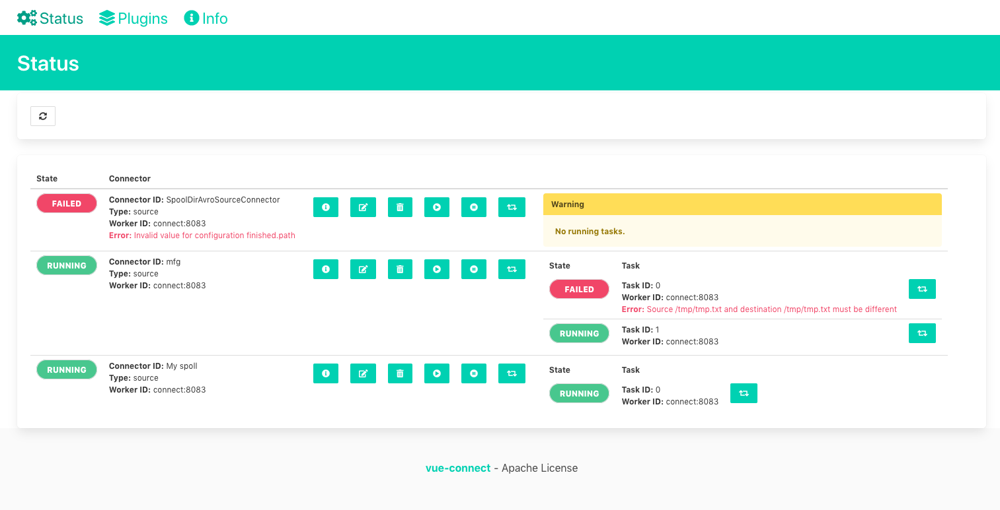

# vue-connect

**vue-connect** is a simple and open source Kafka Connect UI for setting up and managing connectors. 

> **Note**: This project is under development and there is no release yet.

## Features
- Connector status overview
- Delete, pause and resume connectors
- Restart tasks and connectors
- Install new connectors
- Update connector configuration



## Components
vue-connect is build with [Vue.js](https://vuejs.org/) and [Python](https://www.python.org/).

- [vue-connect-api](vue-connect-api) - the backend service project.
- [vue-connect-ui](vue-connect-ui) - the ui project.

## Run vue-connect

tbd


## Build from Source
- See [vue-connect-ui](vue-connect-ui/README.md) how you can build the *Vue.js* frontend.
- See [vue-connect-api](vue-connect-api/README.md) how you can build the *Python* backend.


### Docker Image

To run the vue-connect locally you use the Docker image. This image will
bundle the frontend and backend together in one image.

```
docker build . -t vue-connect
```

Next we can start the Docker image. With `CONNECT_URL`you can set the Rest Endpoint which should be used by vue-connect.
```
docker run --rm -it -p 8080:8080 -e "CONNECT_URL=http://localhost:8083" vue-connect 
```

### Docker Compose 
Or you can use the Docker Compose file [docker-compose.yml](docker-compose.yml) which starts a Kafka Connect cluster with the latest vue-connect version from this branch.

```
docker-compose up --build
```


## Todo
- Add Tests
- Add build pipeline
- Add changelog and version
- Improve error handling
- Write documentation
- Provide Docker image
- Improve UI for multiple workers (Connect Cluster)

## License
The project is licensed under the [Apache](LICENSE) license.